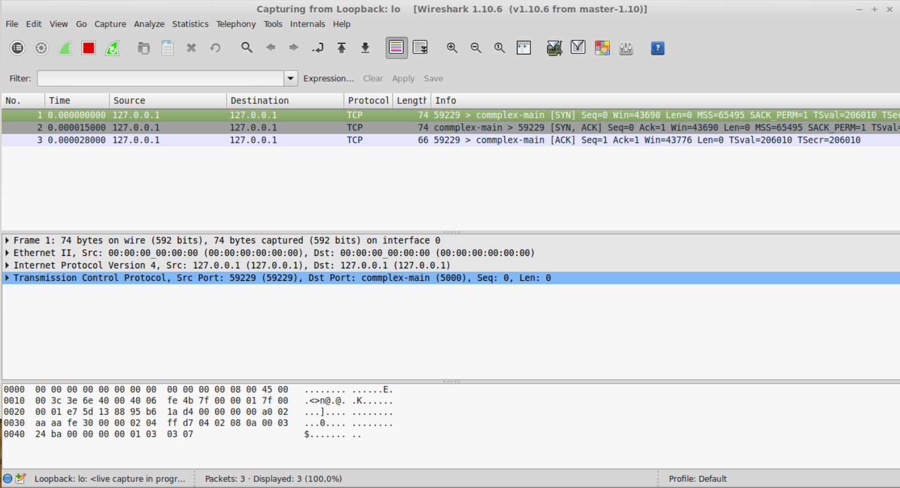
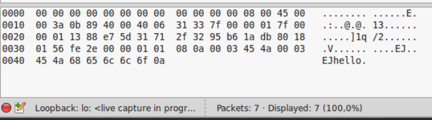
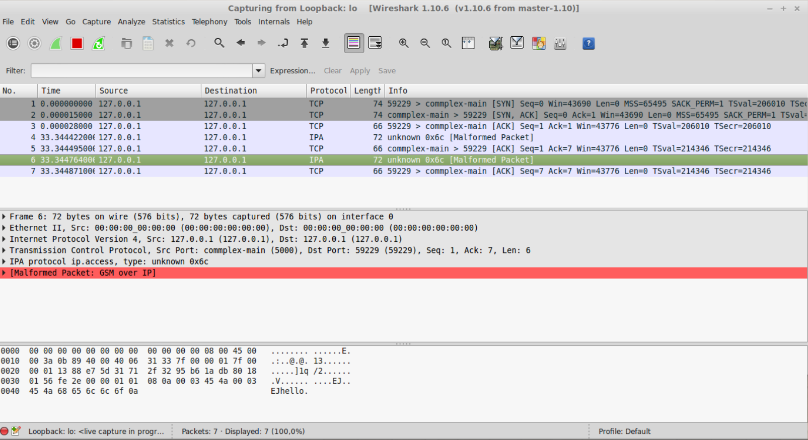
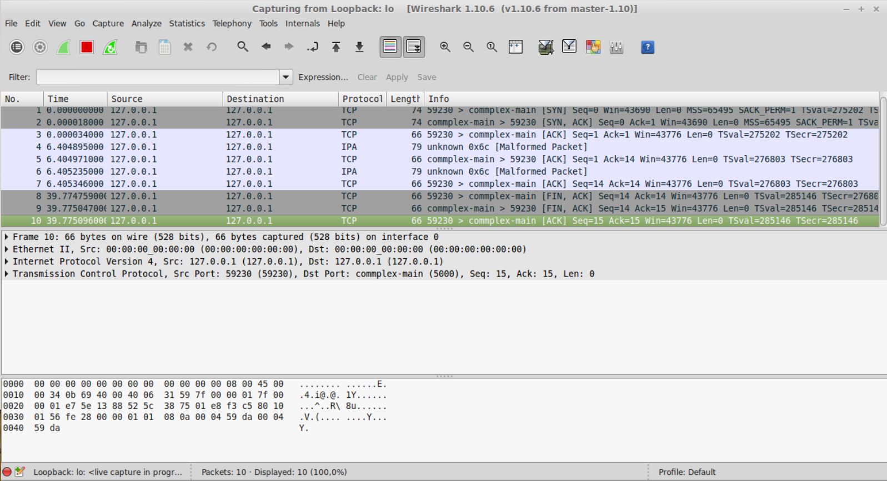

# Pemrograman Jaringan

---

## Outline
- Server menangani banyak klien
- Select
- Server
- Klien
- Poll
- Tutorial Python
- Read/Write File
- Debug dengan Wireshark
- SocketServer

---

## Modul Select

### Modul Select
Select adalah mekanisme I/O multiplexing yang memungkinkan sebuah program untuk mengawasi beberapa file descriptor (termasuk socket) dan menentukan apakah mereka siap untuk operasi I/O. Ini sangat berguna untuk server yang perlu menangani banyak koneksi klien secara bersamaan tanpa menggunakan multithreading.

Fungsi utama dalam modul select Python adalah `select()` yang menerima tiga list parameter:
- **rlist**: List socket yang akan dicek apakah siap untuk dibaca
- **wlist**: List socket yang akan dicek apakah siap untuk ditulis
- **xlist**: List socket yang akan dicek apakah terjadi exception

Fungsi ini akan mengembalikan tiga list berisi socket yang siap untuk dibaca, ditulis, atau yang mengalami exception.

```python
ready_to_read, ready_to_write, in_error = select.select(rlist, wlist, xlist[, timeout])
```

Keuntungan menggunakan select:
- Dapat menangani banyak koneksi dengan satu thread
- Lebih efisien daripada membuat thread untuk setiap koneksi
- Portabilitas yang baik di berbagai sistem operasi

### Modul Poll
Poll adalah alternatif untuk select yang lebih efisien di beberapa sistem operasi (terutama Linux). Poll menggunakan struktur data yang lebih efisien daripada select, terutama ketika menangani jumlah file descriptor yang besar.

```python
import select
p = select.poll()

# Mendaftarkan file descriptor untuk diawasi
p.register(fd, select.POLLIN | select.POLLPRI | select.POLLOUT)

# Melakukan polling
events = p.poll(timeout)
```

Keuntungan poll dibandingkan select:
- Tidak ada batasan jumlah file descriptor yang dapat diawasi
- Lebih efisien untuk jumlah descriptor yang besar
- Penggunaan CPU yang lebih rendah

Kelemahan poll:
- Tidak tersedia di semua platform (tidak tersedia di Windows)

---

## Server dengan Select

1. **Create socket**
   - Membuat socket TCP menggunakan `socket.socket()`
   - Mengatur opsi socket seperti `SO_REUSEADDR`

2. **Bind**
   - Mengikat socket ke alamat dan port tertentu dengan `socket.bind()`

3. **Listen**
   - Mendengarkan koneksi masuk dengan `socket.listen()`
   - Parameter menunjukkan jumlah koneksi yang dapat diantri

4. **Make list for sockets**
   - Membuat list untuk melacak semua socket yang perlu diawasi
   - Awalnya hanya berisi socket server

5. **While running**
   - **Select**: Menggunakan `select.select()` untuk menentukan socket mana yang siap
   - **Accept and append to list**: Menerima koneksi baru dan menambahkannya ke list socket
   - **Recv and send**: Menerima data dari klien, memproses, dan mengirim respons

Implementasi server dengan select memungkinkan satu proses server menangani banyak klien secara efisien tanpa membuat thread atau proses baru untuk setiap koneksi.

---

## Klien

1. **Create socket**
   - Membuat socket TCP menggunakan `socket.socket()`

2. **Connect**
   - Menghubungkan ke server dengan `socket.connect()`
   - Menggunakan alamat IP dan port server sebagai parameter

3. **While running**
   - **Read input**: Membaca input dari pengguna atau sumber lain
   - **Send and recv**: Mengirim data ke server dan menerima respons
   - **Break if keyboard interrupt**: Keluar dari loop jika terjadi interupsi keyboard

Klien yang baik harus menangani berbagai situasi seperti:
- Koneksi terputus
- Timeout saat menunggu respons
- Data yang tidak lengkap atau rusak
- Penanganan error yang baik

---

## Konsep Klien-Server: Socket

- **Server**: Proses yang menunggu koneksi dari klien
- **Klien 1**, **Klien 2**, **Klien 3**: Proses yang menginisiasi koneksi ke server

### Socket Server
- Socket klien di sisi server → satu socket per koneksi
- Disimpan dalam sebuah list
- **Socket klien 1**: Menangani komunikasi dengan Klien 1
- **Socket klien 2**: Menangani komunikasi dengan Klien 2
- **Socket klien 3**: Menangani komunikasi dengan Klien 3

Keterangan:
- **Socket klien di server**: Socket yang dibuat server setelah menerima koneksi
- **Socket klien di klien**: Socket yang dibuat klien untuk terhubung ke server

Setiap koneksi klien direpresentasikan oleh dua socket:
1. Socket di sisi klien yang menghubungkan ke server
2. Socket di sisi server yang menangani komunikasi dengan klien tersebut

---

## Contoh Server-Select

```python
import socket

server_address = ('127.0.0.1', 5000)
server_socket = socket.socket(socket.AF_INET, socket.SOCK_STREAM)
server_socket.setsockopt(socket.SOL_SOCKET, socket.SO_REUSEADDR, 1)
server_socket.bind(server_address)
server_socket.listen(5)

input_socket = [server_socket]
```

- Membuat socket, bind, listen
- Memaksa address dan port untuk bisa digunakan
- List untuk menampung socket

```python
import select

while True:
    read_ready, _, _ = select.select(input_socket, [], [])
    for sock in read_ready:
        if sock == server_socket:
            client_socket, client_address = server_socket.accept()
            input_socket.append(client_socket)
        else:
            data = sock.recv(1024)
            print(sock.getpeername(), data)
            if data:
                sock.send(data)
            else:
                sock.close()
                input_socket.remove(sock)
```

- Pengecekan apakah ada socket input yang siap diproses
- Jika socket yang siap adalah **server**, maka `accept()` klien dan tambahkan ke list
- Jika socket yang siap adalah **klien**, maka terima data dan kirimkan kembali ke klien
- Jika tidak ada data yang diterima, tutup socket dan hapus dari list

### Catatan:
- `Select` akan bergantian memproses socket yang siap untuk diproses.
- **Windows**: List input hanya bisa berisi socket.
- **Linux**: List bisa berisi objek lain seperti file descriptor.

---

## Debug dengan Wireshark

### Contoh program klien-server sederhana:
- **Server/Klien**: [GitHub Repository](https://github.com/studiawan/network-programming)
- Jalankan **Wireshark** dengan hak akses root dan monitor loopback interface
- Jalankan **program server**
- Jalankan **program klien**
- **Amati perubahan** yang tercatat pada Wireshark

---

## Tampilan Wireshark

- **Ketika Klien Mengirim Pesan dan Menutup Koneksi**: Anda akan melihat paket SYN, SYN-ACK, dan ACK untuk pembentukan koneksi TCP, diikuti oleh paket-paket data dan akhirnya paket FIN untuk penutupan koneksi.
  
- **Tampilan pada Data yang Dikirim**: Wireshark akan menunjukkan isi data dalam bentuk hex dan ASCII.
  
- **Inisialisasi Program Select**: Tidak akan menunjukkan aktivitas jaringan khusus karena select hanya berjalan di tingkat sistem operasi.
- **Klien Mengirim Data**:
  - Protokol IPA: "GSM over IP" protocol. Protokol yang biasanya menggunakan port 3002, 3003, 3006, 4249, 4250, and 5000 di atas TCP.
  - Malformed packet: paket tidak sesuai dengan protokol yang standar.
  - Commplex-main: service name yang berasosiasi dengan port 5000 pada services file.
    - Trafik ini bisa jadi merupakan service standar yang lain.
    - Hal ini menunjukkan bahwa paket melalui port 5000.
  
- **Klien Menutup Koneksi**: Akan terlihat paket FIN dan ACK sebagai bagian dari proses penutupan koneksi TCP yang baik.
  

---

## SocketServer

SocketServer adalah modul tingkat tinggi di Python yang menyediakan framework untuk mengimplementasikan server jaringan. Modul ini menyederhanakan proses pembuatan server yang dapat menangani berbagai jenis protokol dan model konkurensi.

Kelas-kelas utama:
- **TCPServer**: Server berbasis TCP
- **UDPServer**: Server berbasis UDP
- **ThreadingMixIn**: Mixin untuk menangani setiap permintaan dalam thread terpisah
- **ForkingMixIn**: Mixin untuk menangani setiap permintaan dalam proses terpisah

Contoh implementasi sederhana:

```python
import socketserver

class MyTCPHandler(socketserver.BaseRequestHandler):
    def handle(self):
        data = self.request.recv(1024).strip()
        print(f"{self.client_address[0]} wrote: {data}")
        self.request.sendall(data.upper())

if __name__ == "__main__":
    HOST, PORT = "localhost", 9999
    with socketserver.TCPServer((HOST, PORT), MyTCPHandler) as server:
        server.serve_forever()
```

### Socket Shutdown

Metode `shutdown()` memungkinkan penutupan setengah koneksi. Ini memungkinkan satu sisi untuk berhenti mengirim data sementara masih dapat menerima data.

```python
# Menutup pengiriman data
socket.shutdown(socket.SHUT_WR)

# Menutup penerimaan data
socket.shutdown(socket.SHUT_RD)

# Menutup kedua arah
socket.shutdown(socket.SHUT_RDWR)
```

Perbedaan antara `close()` dan `shutdown()`:
- `close()` melepaskan sumber daya socket, tetapi tidak menjamin bahwa semua data dalam buffer telah dikirim
- `shutdown()` menghentikan komunikasi tetapi tidak melepaskan sumber daya socket
- Untuk penutupan yang bersih, gunakan `shutdown()` diikuti oleh `close()`

---

## Framing

Framing adalah teknik untuk menandai batas pesan dalam komunikasi jaringan. Ini penting karena TCP hanya menyediakan aliran byte tanpa batas pesan.

1. **Framing 1: Socket Close**
   - Mentransmisikan pesan dan menutup koneksi
   - Cocok untuk protokol HTTP 1.0 sederhana
   - Kelemahan: Overhead karena harus membuat koneksi baru untuk setiap pesan

2. **Framing 2: Streaming in Both Directions**
   - Membuat saluran terpisah untuk pesan dari server dan klien
   - Menghindari konflik pesan dua arah
   - Kelemahan: Kompleksitas implementasi

3. **Framing 3: Use Fix-Length Message**
   - Semua pesan memiliki panjang yang sama
   - Sederhana untuk diimplementasikan
   - Kelemahan: Pemborosan bandwidth untuk pesan pendek, dan pembatasan ukuran maksimum pesan

4. **Framing 4: Use Delimiter**
   - Menandai akhir pesan dengan karakter khusus (seperti '\n')
   - Mudah diimplementasikan dan dipahami
   - Kelemahan: Kompleksitas jika data berisi delimiter, memerlukan escaping

5. **Framing 5: Use Prefix or Header**
   - Setiap pesan diawali dengan header yang mencakup panjang pesan
   - Fleksibel dan efisien
   - Digunakan oleh banyak protokol industri
   - Kelemahan: Sedikit lebih kompleks untuk diimplementasikan

Contoh implementasi framing dengan header:

```python
def send_message(sock, message):
    # Encode the message
    encoded_message = message.encode('utf-8')
    # Create header with message length
    header = len(encoded_message).to_bytes(4, byteorder='big')
    # Send header followed by message
    sock.sendall(header + encoded_message)

def receive_message(sock):
    # Receive the header
    header = sock.recv(4)
    if not header:
        return None
    # Parse the message length
    message_length = int.from_bytes(header, byteorder='big')
    # Receive the message
    chunks = []
    bytes_received = 0
    while bytes_received < message_length:
        chunk = sock.recv(min(message_length - bytes_received, 4096))
        if not chunk:
            raise RuntimeError("Connection closed during message reception")
        chunks.append(chunk)
        bytes_received += len(chunk)
    # Combine chunks and decode
    return b''.join(chunks).decode('utf-8')
```

---

## Tutorial Python untuk Pemrograman Jaringan

### Dasar-dasar Socket di Python

```python
import socket

# Membuat socket TCP
tcp_socket = socket.socket(socket.AF_INET, socket.SOCK_STREAM)

# Membuat socket UDP
udp_socket = socket.socket(socket.AF_INET, socket.SOCK_DGRAM)

# Menghubungkan ke server
tcp_socket.connect(('example.com', 80))

# Mengirim data
tcp_socket.sendall(b'GET / HTTP/1.1\r\nHost: example.com\r\n\r\n')

# Menerima data
data = tcp_socket.recv(4096)

# Menutup socket
tcp_socket.close()
```

### Membuat Server Sederhana

```python
import socket

server_socket = socket.socket(socket.AF_INET, socket.SOCK_STREAM)
server_socket.bind(('0.0.0.0', 8888))
server_socket.listen(5)

print("Server listening on port 8888...")

while True:
    client_socket, client_address = server_socket.accept()
    print(f"Connection from {client_address}")
    
    data = client_socket.recv(1024)
    if data:
        print(f"Received: {data.decode('utf-8')}")
        client_socket.sendall(b"Message received")
    
    client_socket.close()
```

### Membuat Klien Sederhana

```python
import socket

client_socket = socket.socket(socket.AF_INET, socket.SOCK_STREAM)
client_socket.connect(('localhost', 8888))

message = "Hello, server!"
client_socket.sendall(message.encode('utf-8'))

response = client_socket.recv(1024)
print(f"Server response: {response.decode('utf-8')}")

client_socket.close()
```

---

## Read/Write File dalam Pemrograman Jaringan

Sering kali dalam pemrograman jaringan perlu untuk membaca atau menulis file:
- Mengirim file ke klien
- Menerima file dari klien
- Membaca konfigurasi
- Menulis log

### Mengirim File melalui Socket

```python
def send_file(sock, filename):
    # Buka file dalam mode biner
    with open(filename, 'rb') as file:
        # Baca file dan kirim
        while True:
            data = file.read(4096)
            if not data:
                break
            sock.sendall(data)
    # Kirim penanda akhir (opsional, tergantung pada protokol framing)
    sock.sendall(b'\0')
```

### Menerima File melalui Socket

```python
def receive_file(sock, filename):
    # Buka file untuk ditulis dalam mode biner
    with open(filename, 'wb') as file:
        while True:
            data = sock.recv(4096)
            if not data or data == b'\0':
                break
            file.write(data)
```

### Mengirim File dengan Framing

```python
def send_file_with_framing(sock, filename):
    with open(filename, 'rb') as file:
        # Kirim nama file terlebih dahulu
        filename_bytes = filename.encode('utf-8')
        header = len(filename_bytes).to_bytes(4, byteorder='big')
        sock.sendall(header + filename_bytes)
        
        # Dapatkan ukuran file
        file.seek(0, 2)  # Pergi ke akhir file
        file_size = file.tell()
        file.seek(0)  # Kembali ke awal
        
        # Kirim ukuran file
        sock.sendall(file_size.to_bytes(8, byteorder='big'))
        
        # Kirim konten file
        while True:
            data = file.read(4096)
            if not data:
                break
            sock.sendall(data)
```

### Menerima File dengan Framing

```python
def receive_file_with_framing(sock):
    # Terima nama file
    header = sock.recv(4)
    filename_length = int.from_bytes(header, byteorder='big')
    filename = sock.recv(filename_length).decode('utf-8')
    
    # Terima ukuran file
    file_size_bytes = sock.recv(8)
    file_size = int.from_bytes(file_size_bytes, byteorder='big')
    
    # Terima konten file
    received = 0
    with open(filename, 'wb') as file:
        while received < file_size:
            data = sock.recv(min(4096, file_size - received))
            if not data:
                break
            file.write(data)
            received += len(data)
    
    return filename
```

---

## Referensi Source Code Progjar

- [https://github.com/studiawan/network-programming](https://github.com/studiawan/network-programming)
- [https://github.com/brandon-rhodes/fopnp/tree/m/py3](https://github.com/brandon-rhodes/fopnp/tree/m/py3)
- [https://github.com/PacktPublishing/Python-Network-Programming-Cookbook-Second-Edition](https://github.com/PacktPublishing/Python-Network-Programming-Cookbook-Second-Edition)
- [https://github.com/PacktPublishing/Python-Network-Programming](https://github.com/PacktPublishing/Python-Network-Programming)
- [https://github.com/PacktPublishing/Learning-Python-Networking-Second-Edition](https://github.com/PacktPublishing/Learning-Python-Networking-Second-Edition)
- [https://github.com/PacktPublishing/Mastering-Python-Networking-Third-Edition](https://github.com/PacktPublishing/Mastering-Python-Networking-Third-Edition)
- [https://github.com/PacktPublishing/Python-Networking-Cookbook](https://github.com/PacktPublishing/Python-Networking-Cookbook)
- [https://github.com/PacktPublishing/Mastering-Python-for-Networking-and-Security-Second-Edition](https://github.com/PacktPublishing/Mastering-Python-for-Networking-and-Security-Second-Edition)

---