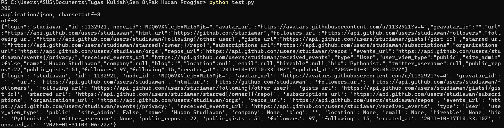

# Pemrograman Jaringan

---

## Outline
- HTTP 1.1 (RFC 2616)
- **HTTP 2**
- **HTTP 3**
- **URI, URL, URN**
- **HTTP Request & Response**
- **HTTP Headers**
- **HTTP Methods & Status Codes**
- **HTTP di Python**
- **HTML Parsing**
- **Python `requests` Module**

---

## URI, URL, dan URN
### **URI (Uniform Resource Identifier)** 

Identifikasi suatu resource physical atau logical pada Internet. Sebuah URI dapat menunjukkan informasi alamat, nama, atau alamat dan nama dari suatu resource. 

Jenis URI yang paling umum digunakan adalah URL (Uniform Resource Locator), namun URI juga dapat berupa URN (Uniform Resource Name).


### **URL (Uniform Resource Locator)** 

URI yang mengidentifikasi alamat yang dapat digunakan untuk mengakses sebuah resource yang ada pada Internet. Semua URL adalah URI, namun tidak semua URI adalah URL.

Penulisan URL mengikuti struktur URI, yang terdiri dari beberapa bagian dan ditunjukkan sebagai berikut: 
```
scheme:[//authority]path[?query][#fragment]
```

**Scheme** adalah bagian URI yang terletak sebelum tanda ```:```. Bagian ini menunjukkan protokol apa yang digunakan untuk memperoleh resource. Beberapa contoh scheme antara lain adalah ```http```, ```https```, ```blob```, ```data``` dan sebagainya.

**Authority** adalah bagian URI yang menunjukkan domain yang memiliki kepemilikan terhadap resource URI. Authority dapat terdiri dari bagian-bagian ```host```, ```port```, dan ```user``` (opsional) dengan contoh sintaks sebagai berikut:

```
host
host:port
user@host
user@host:port
```

**Path** menunjukkan direktori atau lokasi dari resource dalam suatu domain. Bagian path terletak setelah Authority dan sebelum Query.

**Query** ditandai dengan tanda ```?``` dan biasa digunakan untuk menyimpan parameter untuk mengakses data dalam domain.

**Fragment** adalah bagian yang terkadang ditemukan di akhir URI. Fragment diawali dengan tanda ```#```. Bagian ini digunakan untuk menunjukkan bagian dari suatu resource, contohnya seperti sebuah bab dalam sebuah dokumen atau momen tertentu dalam suatu video.

### **URN (Uniform Resource Name)** 

URI yang digunakan untuk mengidentifikasi suatu resource secara unik tanpa menunjukkan lokasi atau cara untuk mengakses resource tersebut. Hal ini berbeda dengan URL, yang menunjukkan lokasi atau address dimana suatu resource berada. URN menggunakan ```urn``` scheme, dan terdiri dari sebuah ```namespace``` beserta ```identifier```.

### Contoh URL
``` 
ftp://ftp.is.co.za/rfc/rfc1808.txt
telnet://192.0.2.16:80/
http://www.progjar.org/wiki/tugas.txt
http://www.progjar.org
```

### Contoh URN
```
urn:isbn:0451450523
urn:uuid:6e8bc430-9c3a-11d9-9669-0800200c9a66
urn:ietf:rfc:3986
urn:namespace:identifier
```

---

## Ilustrasi HTTP

HTTP adalah protokol yang digunakan untuk men. Protokol adalah dasar dari setiap pertukaran data di Web dan menggunakan model klien-server, yang berarti permintaan dimulai oleh penerima, biasanya browser Web. Dokumen lengkap biasanya dibuat dari sumber daya seperti konten teks, instruksi tata letak, gambar, video, skrip, dan banyak lagi.


### **HTTP Klien** 

HTTP Klien biasanya berupa browser (ex: Chrome, Safari, Edge), namun juga bisa dalam bentuk program atau device lainnya.

#### Tugas HTTP Klien:
- Mengirim HTTP Request ke server.
- Menunggu respon dari server.
- Menampilkan respon dari server pada device klien. 

### **HTTP Server** (ex: Nginx)
HTTP Server selalu berjalan untuk menunggu request dari klien.

#### Tugas HTTP Server:
- Menerima request dari klien dan mengalihkan (redirect) ke website tertentu.
- Memproses data dari klien.
- Menerima respons dari website dan di-forward ke klien (HTTP Response).

### **HTTP Request** → **HTTP Response**
Dalam protokol HTTP, komunikasi antara klien dan server berlangsung melalui **request** dan **response**. **HTTP request** dikirim oleh klien ke server untuk meminta sumber daya tertentu, sedangkan **HTTP response** dikirim oleh server sebagai jawaban atas request dari klien. 

---

### Struktur HTTP Request

1. **Request Line**
```http
GET / HTTP/1.1
```
HTTP Request line terdiri dari bagian sebagai berikut:

`GET`: Metode HTTP yang digunakan untuk meminta sumber daya dari server.

`/`: Path atau endpoint yang diminta dari server.

`HTTP/1.1`: Versi protokol HTTP yang digunakan.

2. **Request Header**
```http
Host: www.its.ac.id
User-Agent: Mozilla/5.0 (Macintosh; Intel Mac OS X 10.15; rv:109.0) Gecko/20100101 Firefox/110.0
Accept: text/html,application/xhtml+xml,application/xml;q=0.9,image/avif,image/webp,*/*;q=0.8
Accept-Language: en-US,en;q=0.5
Accept-Encoding: gzip, deflate, br
Connection: keep-alive
Cookie: _ga=GA1.3.1553611766.1631318143; pll_language=en;
Upgrade-Insecure-Requests: 1
```

Request header terdiri dari key-value pair yang berisi metadata dari HTTP Request. Beberapa metadata yang umum ditampilkan termasuk:

1. **Host**: Menunjukkan server tujuan dari request (www.its.ac.id).
2. **User-Agent**: Informasi tentang perangkat dan browser yang digunakan oleh klien.
3. **Accept**: Menentukan format data yang dapat diterima oleh klien.
4. **Accept-Language**: Bahasa yang diinginkan oleh klien.
5. **Accept-Encoding**: Jenis kompresi yang dapat diterima oleh klien.
6. **Connection**: Jenis koneksi yang digunakan (ex. keep alive).

3. **Request Body** (POST)
```http
POST /users HTTP/1.1
Host: example.com
Content-Type: application/x-www-form-urlencoded
Content-Length: 50

name=FirstName%20LastName&email=bsmth%40example.com
```
Request Body hanya ada untuk beberapa metode seperti `POST`, `PUT`, `PATCH`, dll. Bagian ini berisi:

1. **Method**: Metode HTTP yang digunakan untuk mengirim data ke server.
2. **Host**: Menunjukkan server tujuan dari request (example.com).
3. **Content-Type**: Menentukan format data yang dikirim (application/x-www-form-urlencoded).
4. **Content-Length**: Menentukan ukuran data dalam body request.
5. **Body**: Berisi data yang dikirimkan ke server, dalam contoh ini adalah nama dan email pengguna.


### Struktur HTTP Response
#### **Status Line**
```http
HTTP/1.1 200 OK
```
Bagian pertama dari HTTP Response adalah status line yang terdiri dari bagian berikut:
```
<protocol> <status-code> <status-text>
```

1. **Protocol**: Menunjukkan versi HTTP yang digunakan.
2. **Status code**: Status code dari respons yang didapat.
3. **Status text**: Teks singkat yang mendeksripsikan status code.

#### **Response Header**
```http
Server: nginx/1.10.3
Date: Sun, 12 Mar 2023 05:30:09 GMT
Content-Type: text/html; charset=UTF-8
Content-Length: 18085
Connection: keep-alive
Link: <https://www.its.ac.id/wp-json/>; rel="https://api.w.org/"
Content-Encoding: gzip
```
Response header terdiri dari key-value pair yang berisi metadata dari HTTP Response. Beberapa metadata yang umum ditampilkan termasuk:

1. **Content-Type**: Format isi respons
2. **Content-Length**: Ukuran isi respons dalam byte
3. **Date**: Kapan respons dihasilkan
4. **Server**: Informasi tentang perangkat lunak server
5. **Set-Cookie**: Menetapkan cookies ke klien

#### **Response Content** (HTML, CSS, JS)

- Konten/muatan sebenarnya yang dikembalikan
- Opsional (beberapa respons seperti 204 No Content tidak memiliki isi)
- Format ditentukan oleh header Content-Type (HTML, JSON, XML, dll.)
- Mungkin dikompresi jika ditentukan dalam header

---

## HTTP Headers

### HTTP Request Header Contoh:
```http
GET / HTTP/1.1
Host: www.its.ac.id
User-Agent: Mozilla/5.0 (Macintosh; Intel Mac OS X 10.15; rv:109.0) Gecko/20100101 Firefox/110.0
Accept: text/html,application/xhtml+xml,application/xml;q=0.9,image/avif,image/webp,*/*;q=0.8
Accept-Language: en-US,en;q=0.5
Accept-Encoding: gzip, deflate, br
Connection: keep-alive
Cookie: _ga=GA1.3.1553611766.1631318143; pll_language=en;
Upgrade-Insecure-Requests: 1
```

### HTTP Response Header Contoh:
```http
HTTP/1.1 200 OK
Server: nginx/1.10.3
Date: Sun, 12 Mar 2023 05:30:09 GMT
Content-Type: text/html; charset=UTF-8
Content-Length: 18085
Connection: keep-alive
Link: <https://www.its.ac.id/wp-json/>; rel="https://api.w.org/"
Content-Encoding: gzip
```

---

## HTTP Request Methods
- **GET** → Mengambil data dari server
- **POST** → Mengirimkan data ke server
- **PUT** → Memperbarui sumber daya di server
- **DELETE** → Menghapus sumber daya di server
- **HEAD** → Mengambil header tanpa konten

---

## HTTP Status Codes

### Contoh Status Code
- **200 OK** → Permintaan berhasil
- **301 Moved Permanently** → Redirect permanen
- **400 Bad Request** → Permintaan tidak valid
- **401 Unauthorized** → Akses tidak diizinkan
- **403 Forbidden** → Dilarang mengakses
- **404 Not Found** → Sumber daya tidak ditemukan
- **500 Internal Server Error** → Kesalahan di server

---

## HTTP di Python

### Parsing HTTP Data
```python
data = sock.recv(4096)
print('data:', data)
if data:
    data = data.decode('utf-8')
    request_header = data.split('\r\n')
    print('request header:', request_header)
    request_file = request_header[0].split()[1]
    response_header = b''
    response_data = b''

    if request_file in ['index.html', '/', '/index.html']:
        with open('index.html', 'r') as f:
            response_data = f.read()

        content_length = len(response_data)
        response_header = 'HTTP/1.1 200 OK\r\nContent-Type: text/html; charset=UTF-8\r\nContent-Length: ' + str(content_length) + '\r\n\r\n'
        sock.sendall(response_header.encode('utf-8') + response_data.encode('utf-8'))
    else:
        sock.sendall(b'HTTP/1.1 404 Not Found\r\n\r\n')
```
- **Memproses Header**
- **Memproses Konten yang Akan Dikirim**

---

## Menggunakan Modul `requests` di Python
Modul `requests` adalah sebuah modul python yang dapat digunakan untuk mengirimkan HTTP request pada sebuah alamat web dengan mudah. Berikut adalah contoh penggunaan modul `requests` untuk membuka profil github publik.

```python
import requests

r = requests.get('https://api.github.com/users/studiawan', auth=('user', 'pass'))
print(r.status_code)  # 200
print(r.headers['content-type'])  # 'application/json; charset=utf8'
print(r.encoding)  # 'utf-8'
print(r.text)  # JSON Response
print(r.json())  # Dictionary Response
```


Output dari program menunjukkan berbagai informasi publik dari profil Github yang direquest. Respons ini ditampilkan dalam tipe data dictionary untuk kemudian diproses lebih lanjut.

- **Melakukan request ke server**

Pengiriman HTTP request dapat dilakukan dengan memanggil fungsi `requests.get()` untuk GET request, `requests.post()` untuk POST request, selain itu juga terdapat pula `requests.delete()`, `requests.head()` dan `requests.options()` untuk jenis HTTP request lainnya.

```
r = requests.put('https://httpbin.org/put', data={'key': 'value'})
r = requests.delete('https://httpbin.org/delete')
r = requests.head('https://httpbin.org/get')
r = requests.options('https://httpbin.org/get')
```
- **Mengambil respon dengan mudah**

Respon akan disimpan dalam bentuk objek `requests.Response` dan dapat diolah dengan mudah.

Untuk melihat dokumentasi request lebih lengkap dapat dicek pada link berikut: https://requests.readthedocs.io/en/latest/index.html

---

## Referensi
- [Python Requests Documentation](https://requests.readthedocs.io/en/latest/)
- [GitHub: Python Requests](https://github.com/psf/requests)
- [Belajar HTTP di httpbin.org](http://httpbin.org)
- [Contoh Program](https://github.com/studiawan/network-programming/tree/master/bab05)
- [Referensi URI Mozilla](https://developer.mozilla.org/en-US/docs/Web/URI)

---
